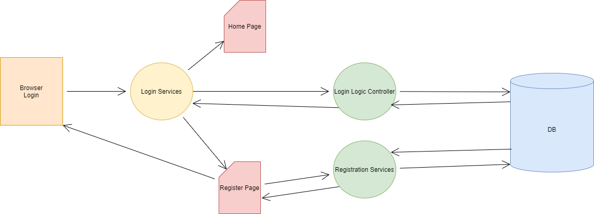
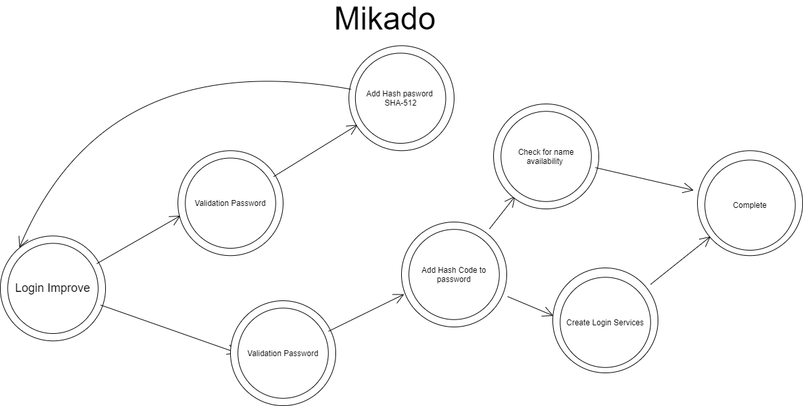

# LoginService
Login and Registration Microservice POC

## Application Diagram



## Mikado Problem Solving Approach



Las tecnologías utilizadas fueron:
- Java versión 11 como lenguaje de programación
- Spring Boot para la creación de los microservicios
- JSP para la creación de páginas e interacción con el usuario
- MariaDB como base de datos

La secuencia de ejecución de la aplicación es la siguiente:

1. El usuario carga la raiz (‘/’) del sitio. Esto dispara un evento en el controlador LoginController que le muestra la página de ingreso
2. El usuario puede escoger registrarse en la aplicación. Eso dispara otro evento en el LoginController que le muestra la página de registro. 
    - El usuario completa la información de registro (usuario, correo, confirmación de correo electrónico, contraseña y confirmación de la contraseña) y presiona el botón para registrarse.
    - El LoginController valida que el correo electrónico y su confirmación sean iguales. De lo contrario muestra de nuevo la página de registro, con un mensaje de error.
    - El LoginController valida que la contraseña y su confirmación sean iguales. De lo contrario muestra de nuevo la página de registro, con un mensaje de error.
    - El LoginController llama al RegistrationService, otro microservicio que corre aparte, con los parámetros para crear un usuario.
    - El RegistrationService valida primero si existe un usuario con ese nombre. En caso de existir, retorna false.
    - El RegistrationService crea el usuario en la base de datos y retorna true en caso de haberlo podido crear
    - El LoginController valida que el RegistrationService retorne true, y le muestra al usuario de nuevo la página de login con un mensaje de éxito en la creación del usuario.
3. El usuario escoge realizar el login. Ingresa su usuario y contraseña y presiona el botón de login.
    - El LoginController toma el usuario y contraseña ingresados y ejecuta un llamado al LoginLogicController, otro microservicio que valida el usuario en la base datos.
    - El LoginLogicController toma el usuario y contraseña y lo compara contra el que se encuentra guardado en la base de datos.
    - En caso de validar que el usuario y contraseña son iguales a alguno de los registros de la base de datos, el LoginLogicController retorna true.
    - En caso de que no exista el usuaro o que exista y la contraseña no coincida con la del usuario, el LoginLogicController retorna false.
    - El LoginController obtiene la respuestas del LoginLogicController. 
    - En caso que la respuesta sea false, el LoginController envia al usuario a la página de login de nuevo, con un mensaje de error.
    - En caso que sea true, redirecciona al usuario al home page.


## Database Setup

To install the database, download MariaDB and create a database using:

```
mysql_install_db.exe --datadir=E:\Development\LoginService\DB --service=ServiceDB --password=secret
```

Create the Schema:

```
CREATE DATABASE `servicedb` /*!40100 DEFAULT CHARACTER SET latin1 */;

create table user (id integer not null auto_increment, email varchar(255), password varchar(255), username varchar(255), primary key (id)) engine=MyISAM


```

Username/Password are root/secret (make sure to change this)

## TODO:

* Change Path parameters to POST parameters

* Change REST call to POST

* Refactor copied User model classes

* Run in containers